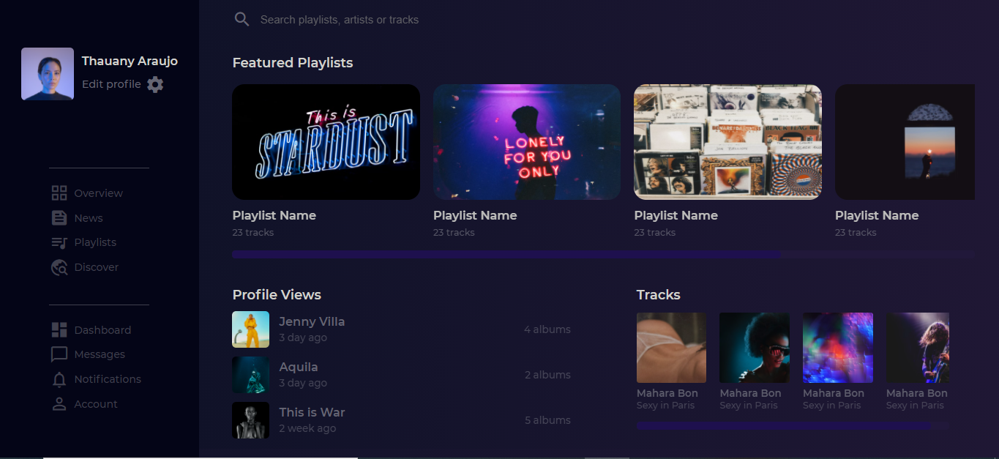

 

    

  <h3 align="center">Music Library Page by <a href="https://www.linkedin.com/in/emmanuel-messias-535621127/">Emmanuel Messias</a></h3>
  
  

     Página de biblioteca de músicas
        
     
    <a href="https://github.com/mannoeu/landing-page-music">Desafio</a>
    ·
    <a href="https://www.devchallenge.com.br/">DevChallenge</a>
  

## Índice

* [Devchallenge](#devchallenge) 
* [Desafio](#desafio)
* [Techs](#techs)
* [Meu resultado](#meu-resultado)

# Devchallenge
<a href="https://devchallenge.now.sh/"> DevChallenge</a> permite que você evolua suas skills como programador! Participe da nossa <a href="https://discord.gg/yvYXhGj">comunidade</a> o/

# Desafio
O desafio consiste em reproduzir um dashboard de um sistema de músicas semelhante ao Spotify, onde é possível visualizar playlists, tracks e artistas.
O modelo final está disponível na pasta "design"

## Requisitos:
- Sua página deverá conter uma barra lateral fixa com as opções de menu 
- Sua página deverá contar com listas de visualização das playlists, dos perfils e das músicas 
- Sua página deverá ser responsiva

### Requisitos bônus
- Você poderá adicionar uma visualização individual da música quando o usuário clicar na mesma

# Techs: 
- HTML, CSS e JavaScript

# Meu resultado

    

Desafio criado por  <a href="https://www.linkedin.com/in/emmanuel-messias-535621127/">Emmanuel Messias</a> :)
